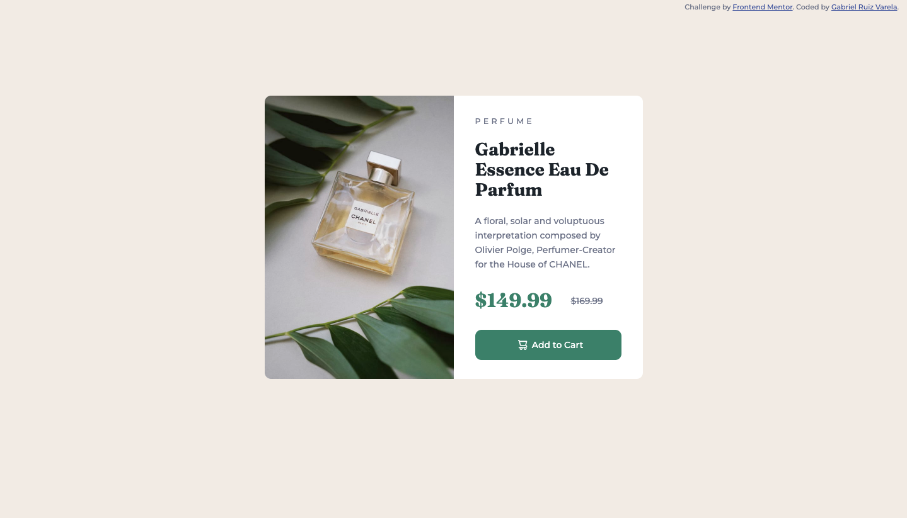

# Frontend Mentor - Product preview card component solution

This is a solution to the [Product preview card component challenge on Frontend Mentor](https://www.frontendmentor.io/challenges/product-preview-card-component-GO7UmttRfa). Frontend Mentor challenges help you improve your coding skills by building realistic projects. 

## Table of contents

- [Overview](#overview)
  - [The challenge](#the-challenge)
  - [Screenshot](#screenshot)
  - [Links](#links)
- [My process](#my-process)
  - [Built with](#built-with)
  - [Continued development](#continued-development)
- [Author](#author)
- [Acknowledgments](#acknowledgments)

## Overview

### The challenge

Users should be able to:

- View the optimal layout depending on their device's screen size
- See hover and focus states for interactive elements

### Screenshot

### Links

- Solution URL: [Add solution URL here](https://github.com/GabrielRuizVarela/Frontend-Mentor-product-preview-card-component)
- Live Site URL: [Add live site URL here](https://gabrielruizvarela.github.io/Frontend-Mentor-product-preview-card-component/)

## My process

### Built with

- HTML5
- SCSS
- Webpack
- EsLint
- gh-pages

### Continued development

I'm currently going through [The Odin Project](https://Theodinproject.com) Full-Stack JS course, currently studying TDD.

## Author

- Github - [@GabrielRuizVarela](https://github.com/GabrielRuizVarela)
- Frontend Mentor - [@GabrielRuizVarela](https://www.frontendmentor.io/profile/GabrielRuizVarela)
- E-mail - [gabrielruizvarela@gmail.com](mailto:gabrielruizvarela@gmail.com)

## Acknowledgments
Thanks, Frontend Mentor and The Odin Project for making learning web development easier and accessible.
